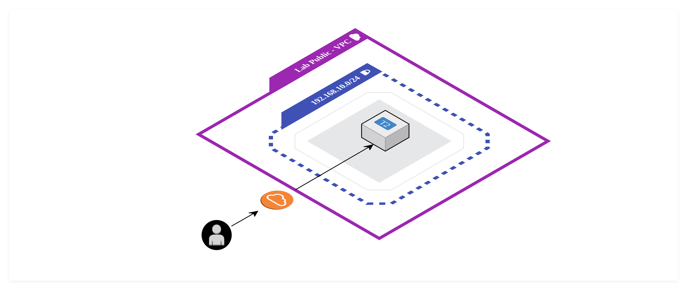

<h1>Lab - 001</h1>

  

Develop an infrastructure with the following features:

<ul>
     <li>An ubuntu ec2</li>
     <li>A static IP network interface for the Ec2</li>
     <li>A securiti Group for HTTP and SSH access</li>
     <li>A key pair to access the instance</li>
</ul>

## Prerequisites

Before applying terraform, it is necessary to have created a base configuration
of a VPC to apply the laboratory. The resources are:

<ul>
     <li>VPC</li>
     <li>Subnet (The public subnet must have Auto-assign IP enabled)</li>
     <li>Internet Gateway</li>
</ul>

