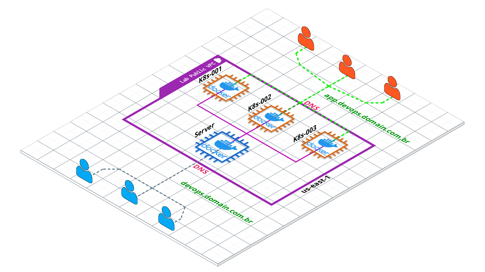

<center>
<h1>Lab - 003</h1>
</center>

<p align="center">
  
</p>


#### Locals.tf
```
locals {
  region = "" // aws region
}

locals {
  profile = "" // Profile set on .aws/credentials 
}

locals {
  vpc_id = "" // VPC ID
  igw_id = "" // Internet Gateway
}

locals {
  ec2 = {
    ami_id        = ""
    instance_type = ""
  }
}
```